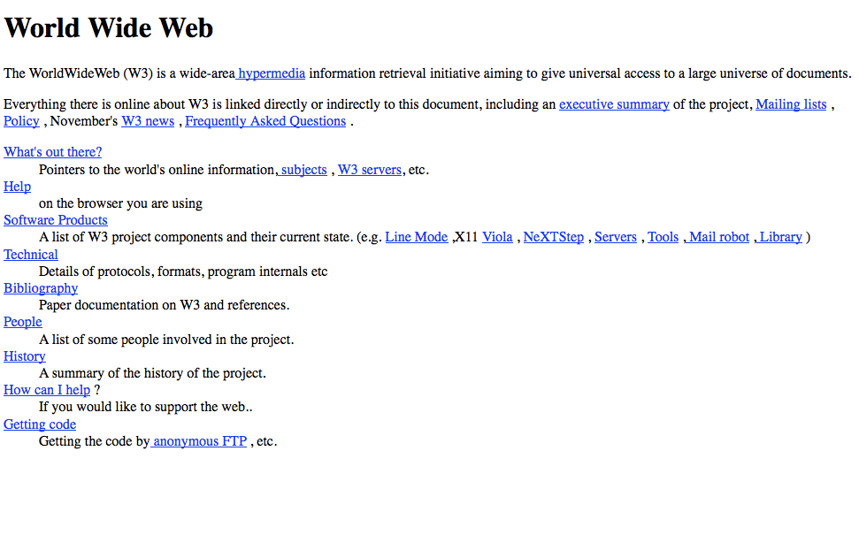
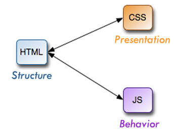
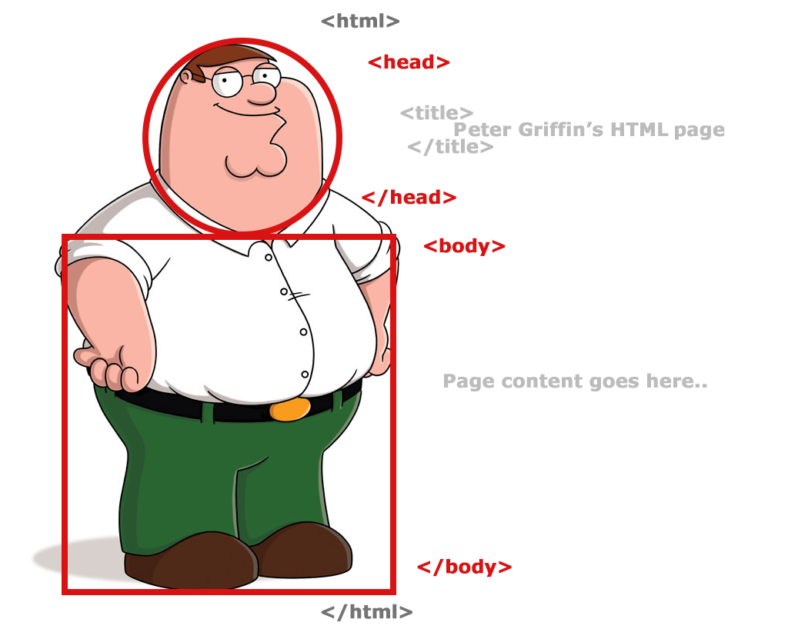
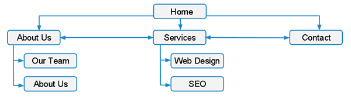

***

## I am not an R developer

- No real experience with it; I did attend many meetups related to R in the past few years

- Mostly a C++ / Go / C# / Python / etc developer who would like to become a machine learning researcher one day :)

- Sorry for any mistakes that I might make. Please let me know if you notice any!


## What is [web scraping](https://en.wikipedia.org/wiki/Web_scraping)?

- Web scraping (web harvesting or web data extraction) is a computer software technique of extracting information from web pages

- This is accomplished by either directly implementing the Hypertext Transfer Protocol (on which the Web is based), or by embedding a web browser

- Web crawling is the process of indexing web pages from a given web site by following hyperlinks, similar to the way a search engine operates

- A web site is a collection of web pages (or web apps) which are grouped together and usually connected together in various ways
    - for example, a collection of web pages which are located under the same common domain constitute a web site


## What can it be used for?

- Extracting data from web sites / web pages in a structured format

- Automating frustrating manual labour
  - when copy / pasting tables from a web page to Excel, sometimes it doesn't come out right

Note: Make sure that the data you're trying to scrape hasn't already been scraped and made public by somebody else!
  - My collection: https://github.com/mihaitodor/datasets
  - Other sources: https://www.quora.com/Where-can-I-find-large-datasets-open-to-the-public


## What is a [web page](https://en.wikipedia.org/wiki/Web_page)?

- The representation of a document that is identified by a unique URL (Uniform Resource Locator)

- It can be accessed through a web browser application and rendered in a human inteligible form




## Web page components

- [Hypertext Markup Language (HTML)](https://en.wikipedia.org/wiki/HTML)

- [Cascading Style Sheets (CSS)](https://en.wikipedia.org/wiki/Cascading_Style_Sheets)

- [JavaScript](https://en.wikipedia.org/wiki/JavaScript)




## Aside: Web pages vs web apps

- The easiest way to extract data from web apps is to use their APIs:
  - [Rfacebook](https://cran.r-project.org/web/packages/Rfacebook/)
  - [twitteR](https://cran.r-project.org/web/packages/twitteR/)
  - [gmailr](https://cran.r-project.org/web/packages/gmailr/)
  - Big list of web APIs: https://www.programmableweb.com/apis/directory
  
- Personal data liberation:
  - [Facebook](https://www.facebook.com/Data-Liberation-179251225495849/)
  - [Twitter](https://support.twitter.com/articles/20170160)
  - [Gmail](https://support.google.com/accounts/answer/3024190?hl=en)
  
- Crawling web apps is a last resort when the APIs and data liberation platforms don't provide the desired data
  - usually, a difficult task
  - [might break the EULA (End User License Agreement)](https://www.quora.com/Is-it-legal-to-use-a-crawler-in-order-to-collect-Facebook-public-data) and you could get sued


## The structure of a web page



- The node elements which are part of an HTML page are loaded into a DOM (Document Object Model) by the browser before they are rendered on the screen

- The HTML `<head>` element provides general information (metadata) about the HTML document, including its title and links to its scripts and style sheets

- The HTML `<body>` element represents the actual content of an HTML document

typical example of `<body>` contents:


## How can we scrape web pages?

- Ideally, all of the page content that we wish to scrape should be static data embedded directly in the HTML
  - if it is injected by some Javascript code into the DOM (Document Object Model) after the page has been loaded, the task can be much more difficult

- The typical approach is to parse HTML into an in memory DOM, which we are then able to query using a query language such as:
  - [CSS](https://en.wikipedia.org/wiki/Cascading_Style_Sheets)
  - [XPath](https://en.wikipedia.org/wiki/XPath)


## Quick intro to CSS selectors

- Test various selectors [here](https://www.w3schools.com/code/tryit.asp?filename=FEZTP2FB9786)

  
## Scraping web pages with rvest

- [Hadley Wickham](http://hadley.nz/) created a module called [rvest](https://cran.r-project.org/web/packages/rvest/)
  - parses an HTML document from a given URL, a file on disk or a string
  - selects parts of a document using CSS selectors or, "if you've a glutton for punishment", XPath selectors
  - inspired from a Python libraries:
    - [Beautiful Soup](https://www.crummy.com/software/BeautifulSoup/)
    - [RoboBrowser](http://robobrowser.readthedocs.io/en/latest/readme.html)

- Demo

```{r}
install.packages("rvest")
install.packages("dplyr")
```

- Example: fetch various data from http://stylebubble.co.uk/
```{r}
library(rvest)
library(magrittr)

html_data <- read_html("http://stylebubble.co.uk/")

# fetch the posts
postsInfo <- html_data %>% html_nodes("div.post > div.post_info")

# print post dates and titles
post_dates <- postsInfo %>% html_nodes("div.post_date") %>% html_text()
post_dates

post_names <- postsInfo %>% html_nodes("h2.post_hdr > a") %>% html_text()
post_names
```

also fetch links to all images and download them
```{r}
library(rvest)
library(magrittr)

html_data <- read_html("http://stylebubble.co.uk/")

images <- html_data %>% html_nodes("div.post > div.entry > p > img[src]") %>% html_attr("src")

# Behold, Mihai's first lambda function in R!
# We want to download all the crawled images to the "images" folder
image.download <- function(x) { download.file(x, paste("images/", basename(x))) }

# Create the "images" folder if it doesn't exist
dir.create("images", showWarnings = FALSE)

# Pipe all images to the previously defined lambda function
images %>% image.download

# Further considerations:
# - parallel downloads
# - duplicate names
```

- Example: fetch Premier League scores from www.goal.com
```{r}
library(rvest)
library(magrittr)
library(dplyr)

html_data <- read_html("http://www.goal.com/en-ie/results/premier-league/8?ICID=FX_TN_93")

data <- html_data %>% html_nodes("table.match-table") %>% (function(match_table) {
  # Use html_text(TRUE) to get rid of leading and trailing whitespace
  date <- match_table %>% html_nodes("th.comp-date") %>% html_text(TRUE)
  
  matches <- match_table %>% html_nodes("tr.clickable") %>% (function(match) {
    list(home_team = match %>% html_nodes("td.team > div.home > span") %>% html_text(TRUE),
         away_team = match %>% html_nodes("td.team > div.away > span") %>% html_text(TRUE),
         score     = match %>% html_nodes("td.vs > div") %>% html_text(TRUE)
    )
  })
  
  list(date = date, matches = matches)
})

glimpse(data)
```


## Web crawling

- Web crawling might be required if the desired data resides on multiple pages from a given web site, which are not known in advance



- Can be a very difficult task:
  - automating user log in might be required
  - some cookies and obfuscated state information might need to be passed from page to page

- Can be made easy if the target web site provides a [sitemap](https://en.wikipedia.org/wiki/Sitemaps)
  - it's easy to find the sitemap (XML file) by inspecting [robots.txt](https://en.wikipedia.org/wiki/Robots_exclusion_standard)
    - more info: http://www.robotstxt.org/robotstxt.html
  - Examples:
    - https://www.datacamp.com/robots.txt
    - http://www.goal.com/robots.txt

## Crawling manners

- Try to respect the rules from robots.txt

- Make sure you don't degrade the website performance if you use a distributed crawler

- Provide identification information through your crawler (relevant name, relevant user agent header, etc)

- Don't anger system administrators

- More info: http://blog.mischel.com/2011/12/20/writing-a-web-crawler-politeness/


## More information

- [Scraping Javascript Generated Data with R](https://www.datacamp.com/community/tutorials/scraping-javascript-generated-data-with-r)

- [Web Scraping with Scrapy](https://github.com/mihaitodor/Presentations/tree/master/pyladies/2016-09-20)


## GitHub URL for these slides

https://github.com/mihaitodor/Presentations/tree/master/r_ladies_dublin/2017-04-26


## Contact

todormihai@gmail.com

https://www.linkedin.com/in/mtodor

https://github.com/mihaitodor
